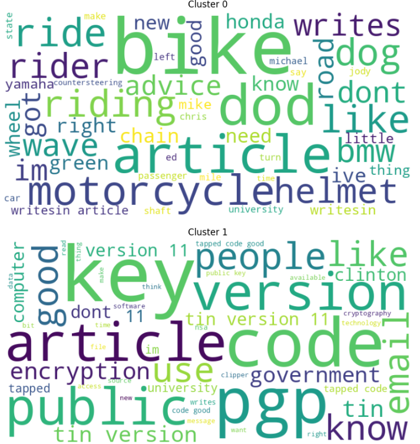
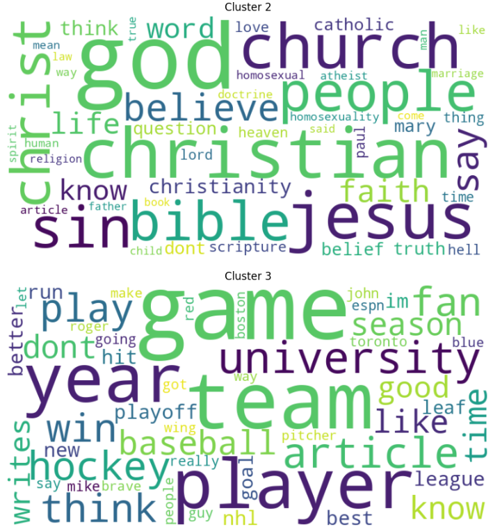

# Unsupervised Text Clustering: 20 Newsgroups Analysis

**A comprehensive machine learning project using KMeans clustering and TF-IDF to discover latent topics within the classic 20 Newsgroups dataset.**

## Project Overview

This repository contains a detailed Jupyter Notebook (`kmeans-analysis.ipynb`) that explores **unsupervised text clustering** using the **KMeans algorithm**. The primary goal is to determine how effectively a clustering algorithm can recover the original 20 topical categories (newsgroups) from a large collection of text documents.

The notebook demonstrates a complete end-to-end pipeline for Natural Language Processing (NLP) and clustering, including robust text preprocessing, feature engineering using TF-IDF, model training, and detailed cluster interpretation using word clouds and top-term analysis.

## Dataset

The project utilizes the **20 Newsgroups** dataset, a classic benchmark dataset in text classification and clustering.

  * **Source:** Loaded directly using `sklearn.datasets.fetch_20newsgroups`.
  * **Size:** Contains **18,846** total articles.
  * **Categories:** The data is naturally divided into **20 distinct newsgroup topics** (e.g., `comp.graphics`, `rec.sport.hockey`, `talk.politics.mideast`, etc.).

## Methodology

The analysis follows these key steps, implemented within the attached Jupyter Notebook:

1.  **Data Loading & Initial Exploration:** The complete dataset is loaded and structured into a pandas DataFrame.
2.  **Text Preprocessing (Cleaning):** A crucial step to prepare the raw text for modeling:
      * Removal of email addresses, headers (`From:`, `Subject:`, etc.), punctuation, digits, and links.
      * Stop word removal using NLTK.
      * Text tokenization and **Lemmatization** (reducing words to their base form).
3.  **Feature Engineering:** The cleaned text is converted into a numerical matrix using the **TF-IDF Vectorizer** to represent the importance of words in the corpus.
4.  **KMeans Clustering:** The KMeans algorithm is applied with `n_clusters=20`, matching the number of true classes to assess the algorithm's performance on the latent structure.
5.  **Cluster Interpretation:**
      * The top 10 most influential terms are extracted from the cluster centroids to label and understand the content of each of the 20 discovered clusters.
      * Each cluster is given a descriptive, interpretable name (e.g., 'Religious Discussion', 'Space and Medical Science', etc.).

## Results & Evaluation

The notebook uses several internal and external evaluation metrics to gauge the quality of the clustering.

| Metric | Score | Interpretation |
| :--- | :---: | :--- |
| **Homogeneity Score** | (Score calculated in notebook) | Measures if all data points belonging to a single cluster are members of a single class (Original Category). |
| **Completeness Score** | (Score calculated in notebook) | Measures if all data points that are members of a given class are in the same cluster. |
| **V-Measure Score** | (Score calculated in notebook) | The harmonic mean of Homogeneity and Completeness. |
| **Adjusted Rand Index (ARI)** | (Score calculated in notebook) | Measures the similarity between the true and predicted clusters, penalized for chance groupings. |
| **Silhouette Score** | (Score calculated in notebook) | Measures how similar an object is to its own cluster compared to other clusters (Cohesion and Separation). |

**Key Finding:** The project successfully reveals that the clustering algorithm can identify meaningful and distinct groups of articles, closely aligning with the original newsgroup topics, with the top terms providing clear thematic labels for the discovered clusters.

## Screenshots & Visualizations

This section showcases the key visualizations generated during the analysis, helping to illustrate the results of the clustering and evaluation.




## Installation & Setup

To run this project, you need Python and the libraries listed below.

### Clone the Repository

```bash
git clone https://github.com/thesjhu/kmeans-analysis
cd kmeans-analysis
```

### Dependencies

The core libraries used in the notebook are:

  * **`pandas`** for data manipulation
  * **`sklearn`** (Scikit-learn) for dataset fetching, TF-IDF, KMeans, and metrics
  * **`nltk`** for text preprocessing (stopwords, lemmatization, tokenization)
  * **`wordcloud`** for visualizing cluster-specific terms
  * **`matplotlib`** for plotting and visualizations
